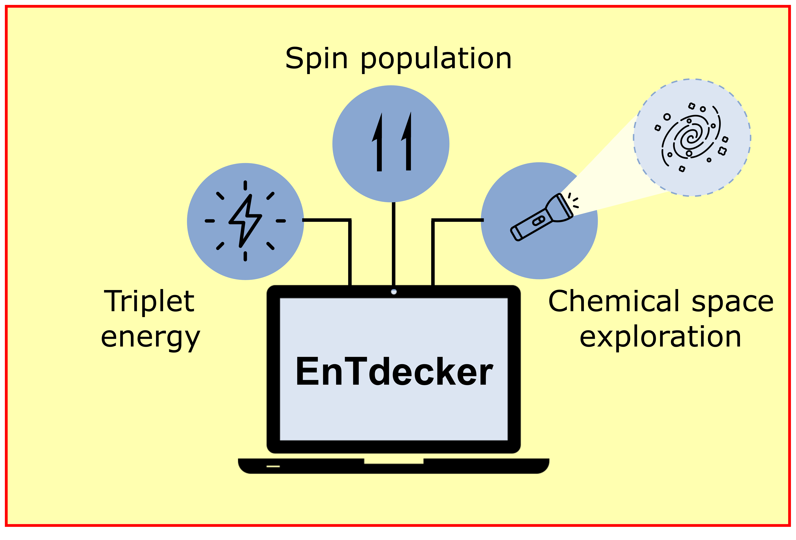

# EnTdecker
This repository contains the code for the prediction of triplet energies and spin populations of organic molecules as described in this paper: TBA

The models can also be used in a web application: [entdecker.uni-muenster.de](http://entdecker.uni-muenster.de)

<p align="center">
  
</p>

## Installation
For installation run
```
git clone --recurse-submodules https://github.com/le-schlo/EnTdecker.git
# option --recurse-submodules is required in order to clone the respective submodules

#go to EnTdecker directory and install all required dependencies
cd EnTdecker
pip install -r requirements.txt

#Additionally you need to go to the EasyChemML directory and install the necessary dependencies separately.
cd EasyChemML
pip install ./
```


## Data

The datasets can be found in `Data/EnT_data.csv` and `Data/EnT_SD_data.csv`, for the triplet energy
prediction and the spin population prediction, respectively. The triplet energy values in `Data/EnT_data.csv` are given in kcal/mol. `Data/EnT_SD_data.csv` contains the input and target strings, to which the spin population for each heavy atom is inserted. Those files can be directly used for training the models. The dataset for finetuning the model can be found in `Data/Retrain_Disulfide.csv` for the triplet energy prediction and in `Data/Retrain_SD_Disulfide.csv` for the spin population prediction. `Data/Pretrain.csv` contains the data
for pretraining the sequence-to-sequence model on the canonicalisation task.

## DataProcessing

The folder `DataProcessing` contains helper functions and scripts for obtaining the splits for the triplet
energy prediction (`RandomSplitter.py`, `MurckoSplitter.py`, `SimilaritySplitter.py`, `OutOfSample.py`) as
well as the data processing for the spin population prediction. The file `SpinExtraction.py` contains a
function that returns the input for the sequence-to-sequence model given a smiles and the
corresponding spin population. The file `TargetRearrangement.py` contains a function that returns
rearranged SMILES including the binned spin population.

## Train models
Sample scripts to train the models can be found in the [Models](Models) directory and the respective sub-directories.
### Triplet energy

Scripts for training the models for predicting the triplet energies can be found in
`Models/triplet_energy`. For training an AttentiveFP-GNN model the file
`Models/triplet_energy/AttFP/train.py` can be run. This code was slightly adapted from the [original
repository](https://github.com/OpenDrugAI/AttentiveFP). For training a chemprop-D-MPNN model
the file `Models/triplet_energy/chemprop/train.py` can be run. Information about defining additional
hyperparameters can be found in the documentation of [chemprop](https://chemprop.readthedocs.io/en/latest/index.html).
For training a transformer-CNN model the file
`Models/triplet_energy/transformer-cnn/transformer-cnn.py` can be run. All parameters for training the
model need to be specified in the `Models/triplet_energy/transformer-cnn/config.cfg` file. Please note
that running the code for the transformer-CNN code requires different dependencies than all other
code. A tutorial on how to set the environment up can be found in the
`Models/triplet_energy/transformer-cnn/README.md` file. For training a CatBoost-GDBT model with
the [MFF fingerprint](https://doi.org/10.1016/j.chempr.2020.02.017) the file `Models/triplet_energy/CatBoost/train.py` can be run.

### Spin population

Scripts for training and evaluating the sequence-to-sequence model for predicting the spin population
can be found under `Models/spin_population/train.py` and `Models/spin_population/eval.py`.

The file `Models/spin_population/settings.json` contains parameters for running the training as well as for running the evaluation.

“dir_name”: provide the path to the directory were the code is executed. This ensures that
the model checkpoints and the results of the evaluation are saved in the correct
location<br>
“file_path”: provide the path to the data file used for training when using running the
train.py or for evaluation when running the eval.py<br>
“src_vocab_size”: specify the size of the vocabulary of the inputs. Default: 106<br>
“src_len”: specify the maximum length of the input sequence. Default: 100<br>
“epochs”: specify the number of epochs used for training the model<br>
“batch_size”: specify the batch size during training and evaluation<br>
“print_every”: specify the frequency an output is printed<br>
“loss_fname”: specify the name of the file the loss will be saved in during training.

## Use pretrained models
Pretrained models can be downloaded from [Zenodo](https://zenodo.org/uploads/10391170).

Sample scripts to use these for obtaining predictions can be found under [Models/triplet_energy/chemprop/eval.py](Models/triplet_energy/chemprop/eval.py) and [Models/spin_population/eval.py](Models/spin_population/eval.py).
